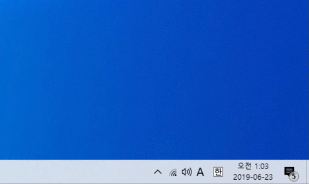

# Battify

Windows 트레이 아이콘 배터리 퍼센트 표시 프로그램

# 요구 사양
- Windows 7+ 이상 버전
- .Net Framework 4.6.1

# 사용 방법
- 프로그램을 실행합니다.

## 사용방법 (시작프로그램으로)
- `Windows + R` 키를 눌러 실행 창을 열고, `shell:startup`을 입력하고 엔터를 누릅니다.
- 곧 뜨는 창에 Battify 실행 파일을 넣고 실행합니다.

(* v1.0 릴리즈부터 설치 매니저를 통해 자동으로 시작프로그램 설정이 가능합니다)
